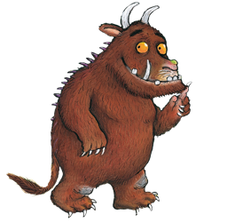

Gruffalo
========

Parser generator.

Based on the RNGLR algorithm described in the paper [Right Nulled GLR Parsers](https://pdfs.semanticscholar.org/ae18/fa7080e85922fa916591bc73cd100ff5e861.pdf) (Elizabeth Scott & Adrian Johnstone, ACM, 2006).

RNGLR parsers accept any context-free grammar, while still being (nearly?) as fast as LR parsers (e.g. yacc).

